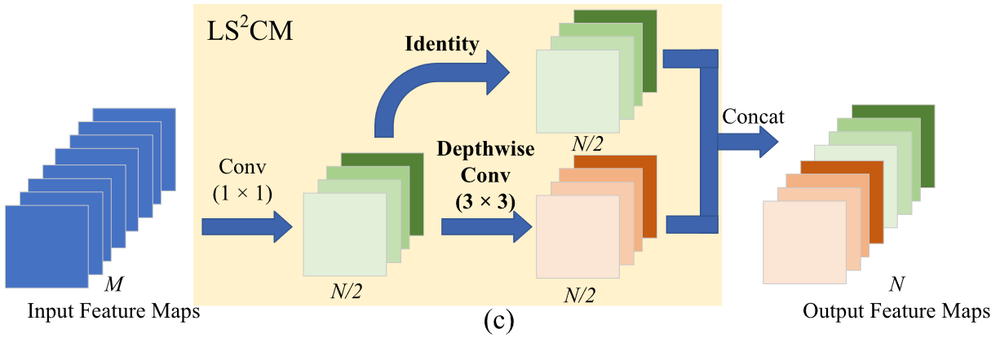
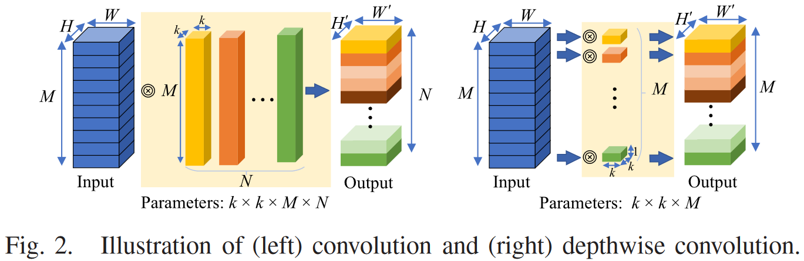

# A lightweight spectral-spatial convolution module for hyperspectral image classification

PyTorch implementation of A lightweight spectral-spatial convolution module for hyperspectral image classification.




# Basic Usage

```
import torch
from LSSCM import LSSCM_ResNet

model = LSSCM_ResNet(num_classes=16, channels=200)
model.eval()
print(model)
input = torch.randn(100, 200, 11, 11)
y = model(input)
print(y.size())
```

# Paper

[A lightweight spectral-spatial convolution module for hyperspectral image classification](https://ieeexplore.ieee.org/document/9395708)

Please cite our paper if you find it useful for your research.

```
@article{meng2021lightweight,
  title={A lightweight spectral-spatial convolution module for hyperspectral image classification},
  author={Meng, Zhe and Jiao, Licheng and Liang, Miaomiao and Zhao, Feng},
  journal={IEEE Geoscience and Remote Sensing Letters},
  volume={19},
  pages={1--5},
  year={2022},
  publisher={IEEE}
}
```

# Reference Paper

* GhostNet: More features from cheap operations https://arxiv.org/abs/1911.11907

# Reference Code

* ghostnet https://github.com/iamhankai/ghostnet.pytorch
